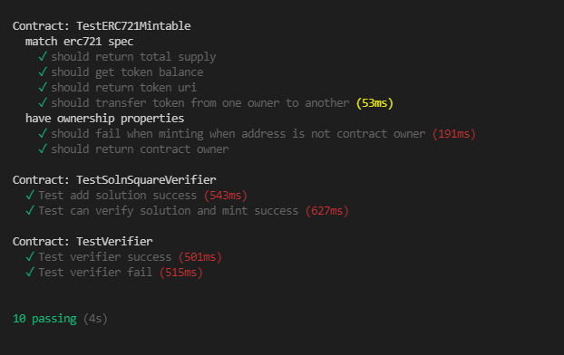

# Udacity Blockchain Capstone

Capstone project to build a decentralized housing product. Contract is deployed on Rinkeby testnet, and transactions can be made on https://testnets.opensea.io/

# Installation

- `npm install` to install all dependencies

# Run Tests

- `cd eth-contracts && truffle test` (Make sure that truffle-config.js is configured wwith the right host and port for the local node)

# Contract address

- https://rinkeby.etherscan.io/address/0x462C7D949b5Ae60F3D8b24fce4e4e4bCBE629c5c

# Contract ABI

- The contract abi for SolnSquareVerifier can be found [here](https://github.com/whenzei/Blockchain-Capstone/blob/master/eth-contracts/SolnSquareVerifierAbi.txt)

# Open Sea Collection

https://testnets.opensea.io/collection/realestatetrading-token

# Project Resources

- [Remix - Solidity IDE](https://remix.ethereum.org/)
- [Visual Studio Code](https://code.visualstudio.com/)
- [Truffle Framework](https://truffleframework.com/)
- [Ganache - One Click Blockchain](https://truffleframework.com/ganache)
- [Open Zeppelin ](https://openzeppelin.org/)
- [Interactive zero knowledge 3-colorability demonstration](http://web.mit.edu/~ezyang/Public/graph/svg.html)
- [Docker](https://docs.docker.com/install/)
- [ZoKrates](https://github.com/Zokrates/ZoKrates)
